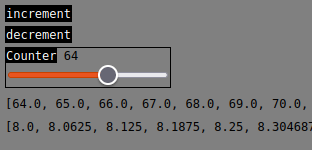

#### 🆕 

- `mojoproject.toml` for `magic` !
- 🔁 Updated for `25.3.0` 🔥!

&nbsp;

#### ➕ Smaller changes/new features
- UI remember scroll position between events and refreshes
- Any window can be minimized/expanded into/from a titlebar with the `➖` button
- Move some parameters from `Server` to `param_get_env`
  - `mojo run -D mojo_ui_html_theme="theme_neutral.css"`
  - `exit_if_request_not_from_localhost` (default: `True`)
- Add custom html easily 
  - `GUI.RawHtml("<h1>Page</h1>")`
- `GUI.CustomEvent('MyEvent')`

  see [demo_custom_events.mojo](./demo_custom_events.mojo)

  (Just a start, not ready/user-friendly yet!) 

- `GUI.Event()` ➡️ `GUI.NeedNewRendition()`

  Because events are handled once,
  
  but multiple renditions are usually done!

- Faster rendering using more types
  
  TODO: `initial_capacity` and `clear()`

- Add `with` ➡️`GUI.HorizontalGrow`, ⬇️`GUI.VerticalGrow` 
  
  Theses are flex `div`, the content added grows it. 
  
  see [demo_horizontal_vertical](./demo_horizontal_vertical_containers.mojo)


&nbsp;

#### 🥾 Quick start
```bash
git clone https://github.com/rd4com/mojo-ui-html
cd mojo-ui-html
magic shell
mojo run demo_principal.mojo
```

&nbsp;

#### ❤️‍🔥 Mojo is a programming language

This gui is built using mojo!

User-friendly, fast, active community, friends, python family, love it!

> **MAX and Mojo usage and distribution are licensed under the [MAX & Mojo Community License](https://www.modular.com/legal/max-mojo-license)**


&nbsp;

#### 🎮 Good start to `learn mojo` by `creating` a small `videogame` !
This new feature: `GUI.keyboard_handler` is cool,

it can work even when there are unfocussed UI widgets in a window👍
```mojo
from ui import *

def main():
    var GUI = Server()
    GUI.request_interval_second = 0 #no Time.sleep between events
    GUI.keyboard_handler = True
    var pos = SIMD[DType.int32, 2](0)   #[x, y] 
    while GUI.NeedNewRendition(): 
        k = GUI.KeyDown()
        if not k.isa[NoneType]():
            # if k.isa[Int]():
            #     print(k[Int])# example: ord('a'), ..
            if k.isa[String]():
                var k_tmp = k[String] 
                if k_tmp == "ArrowUp": pos[1] -= 10
                elif k_tmp == "ArrowDown": pos[1] += 10
                elif k_tmp == "ArrowLeft": pos[0] -= 10
                elif k_tmp == "ArrowRight": pos[0] += 10
        GUI.RawHtml(String(
            "<div style='position:absolute;",
            "left:",pos[0],";",
            "top:", pos[1],";"
            "'>🚙</div>"
        ))
```

⬅️ ⬆️ ⬇️ ➡️ to move the 🚙 on the `html` page!

&nbsp;

#### 📋 Example todo app
```mojo
from ui import *
def main():
    GUI = Server()
    var txt:String = "test"
    var todos= List[String]()  
    var time:String = "15:00"
    var date:String = "2024-01-01"
    var pos = Position(256,128,2.0)
    while GUI.NeedNewRendition():
        with GUI.Window("Todo app",pos):
            GUI.Text(str(len(todos)))
            with GUI.ScrollableArea(128):
                for i in range(len(todos)): 
                    GUI.Text(todos[i])
            GUI.NewLine()

            GUI.TimeSelector(time)
            GUI.DateSelector(date)
            GUI.TextInput("textinput",txt)
            
            if GUI.Button("Add"): 
                todos.append(GUI.Circle.Blue+" "+time+" " + date + " " + txt)
            if GUI.Button("pop"):
                if len(todos):todos.pop()
```

&nbsp;

&nbsp;


#### 🔺 Next todo:
Create a tutorial that adds different widgets to the page (one by one), 

progressively learning how to add to the ui.

&nbsp;

&nbsp;

# mojo-ui-html


- ### 👷👷‍♀️ Under construction, make sure to wear a helmet !

- ### 🤕 Bugs and unexpected behaviours are to be expected

- ### ⏳ not beginner-friendly yet (will be in the future❤️‍🔥) 

- ### Not ready for use yet, feedbacks, ideas and contributions welcome!

&nbsp;

## ⚠️ 
- Server on ```127.0.0.1:8000```
  - not meant to be a web-framework, but a simple ui
  - Exit loop if request from other than "127.0.0.1" by default 
    - As an additional safeguard (not been tested)
- Dom generated from the content of values
  
  - ```example: "<input value='" + value + "'/>"```
  - ```UNSAFE because value content can generate/modify html or javascript.```

- If the widget id is the address of a value, two input widgets of the same value will trigger twice (need more thinking for solution)


- Blocking loop by default

- ❤️‍🔥 [How 'widgets' attempts(⚠️) to maintain the rendering up-to-date ?](#how-widgets-attempts%EF%B8%8F-to-maintain-the-rendering-up-to-date-)
  - Will spin the loop multiple times and send only last rendition as response
  - events are handled once, but multiple renditions are done
  - ```should_re_render()``` for user initiated triggering!
  - once response is sent, need to wait for next request (blocking socket)


- Probably more

&nbsp;


# Principal demo: ```theme.css```(default)


&nbsp;

# Simple simd counters: ```theme_neutral.css``` 



```python
from ui import *
from math import iota, sqrt
from sys import simdwidthof
def main():
    GUI = Server()
    var counter = 0
    while GUI.NeedNewRendition(): 
        #Not necessary to create a window if not needed
        if GUI.Button("increment"): counter+=1
        if GUI.Button("decrement"): counter-=1
        GUI.Slider("Counter",counter)
        var tmp = iota[DType.float16, simdwidthof[DType.float16]()](counter)
        GUI.Text(repr(tmp))
        GUI.Text(repr(sqrt(tmp)))
```

&nbsp;
# Principal demo code:
```python
from ui import *

def main():
    #⚠️ see readme.md in order to be aware about challenges and limitations!
    val = 50
    txt = String("Naïve UTF8 🥳")
    boolval = True
    multichoicevalue = String("First")
    colorvalue = String("#1C71D8")
    datevalue = String("2024-01-01")

    GUI = Server()

    POS = Position(1,1)
    POS2 = Position(1,350)
    POS3 = Position(32,512)
    POS4 = Position(512,16)

    combovalues = List[String]()
    for i in range(5): combovalues.append("Value "+str(i))
    selection = 1

    while GUI.NeedNewRendition():
        with GUI.Window("Debug window",POS):
            GUI.Text("Hello world 🔥")
            if GUI.Button("Button"): val = 50 
            if GUI.Slider("Slider",val): 
                print("Changed")
            GUI.TextInput("Input",txt) #⚠️ ```maxlength='32'``` attribute by default.
            GUI.ComboBox("ComboBox",combovalues,selection)
            GUI.Toggle(boolval,"Checkbox")

        with GUI.Window("Fun features",POS3):
            GUI.Text(GUI.Circle.Green + " Green circle")
            GUI.Text(GUI.Square.Blue + " Blue square")
            GUI.Text(GUI.Accessibility.Info + " Some icons")
            GUI.Text(GUI.Bold("Bold() ")+GUI.Highlight("Highlight()"))
            GUI.Text(GUI.Small("small") + " text")

            with GUI.Collapsible("Collapsible()"):
                GUI.Text("Content")

        with GUI.Window("More widgets",POS4):
            GUI.TextChoice("Multi Choice",multichoicevalue,"First","Second")
            GUI.Ticker("⬅️♾️ cycling left in a 128 pixels area",width=128)

            with GUI.Table():
                for r in range(3):
                    with GUI.Row():
                        for c in range(3): 
                            with GUI.Cell():
                                GUI.Text(str(r) + "," + str(c))
    
            with GUI.ScrollableArea(123):
                GUI.Text(GUI.Bold("ScrollableArea()"))
                GUI.ColorSelector(colorvalue)
                GUI.NewLine()
                GUI.DateSelector(datevalue) #⚠️ format is unclear (see readme.md)
                for i in range(10): GUI.Text(str(i))
        

        with GUI.Window("Values",POS2,CSSTitle="background-color:"+colorvalue): 
            GUI.Text(txt)
            if selection < len(combovalues):      #manual bound check for now
                GUI.Text(combovalues[selection])
            with GUI.Tag("div","background-color:"+colorvalue):
                GUI.Text(colorvalue)
            GUI.Text(datevalue)
            with GUI.Tag("div","padding:0px;margin:0px;font-size:100"):
                GUI.Text("❤️‍🔥")
            GUI.Button("ok",CSS="font-size:32;background-color:"+colorvalue)
```

&nbsp;

## Features
- 🎨 Themed with `CSS`
  - Default theme colors are kept familiar (🎁)🔥
  - `theme.css` where widgets have corresponding entries (class)
  - Customize individual widgets instances styles with keyword arguments
    - dom element style attribute
  - [The current styling system](#-the-current-styling-system)
  - helper function with variadic keyword arguments
    ```python
    #Example
    MyStyleOne = CSS(color="blue",`font-size`=32)
    var MyStyleTwo = CSS(
      `text-shadow` = "1px 1px 1px yellow",
      `font-size` = "32px",
      background = "linear-gradient(#ffff00, #f90)"
    )
    ```

- 🆕 Keyboard event handler
  - Send events only if the user is not already interacting with a dom element.
    - That way, is is still possible to interact with an Input element independently.
  - ```Server.keyboard_handler``` is False by default, as additional safeguard
    ```python
    k = GUI.KeyDown()
    if k.isa[String]():   #special keys (Backspace,ArrowLeft,..)
    if k.isa[Int]():      #Normal characters: chr(k.take[Int]())
    if k.isa[NoneType](): #No sent events or keyboard_handler is False
    ```
  - see [demo_keyboard_and_css.mojo](./demo_keyboard_and_css.mojo)
- Button
  - return True when clicked
  - ```CSS``` keyword argument, for the style attribute of the dom element (default: "")
  - Naïve UTF8 support 🥳
  - ⚠️ Label 
    - can't be too long: behaviour unexpected ([Challenges for utf8 support](#challenges-for-utf8-support))
    - two buttons with the same label lead to wrong event
      - usually, the first one will receive the event *(even if the second was clicked)*


    

- TextInput
  - return ```True``` when UI interaction occured
  - mutate the argument (passed as inout) automatically
  - Naïve UTF8 support 🥳
    - ⚠️ need more work, see challenges sections
    - Additional untested safeguard:
      -  DOM element is limited with the ```maxlength='32'``` attribute by default.
  - ```CSSBox``` keyword argument (default: "")
    - style attribute for the widget container (contains both label and input element)
    - todo: keyword arguments for label and input element
- Text
- Slider
  - return ```True``` when UI interaction occured
  - ```label:String``` not optional
  - mutate ```inout val:Int``` argument
  - ```min:Int=0, max:Int=100``` keyword arguments
  - ```CSSLabel``` keyword argument, style attribute of label (default:  "")
  - ```CSSBox``` keyword argument, style attribute of widget container (default: "")
- Windowing system (optional)
  - ```Minimized``` by clicking the ```-``` icon on the title bar
    (stored in Position struct)
    ```python
    #example, var MyWindow: Position, var GUI:Server
    with GUI.Window("The Title",MyWindow):
      if MyWindow.opened: GUI.Text("opened")
    ```
  - ```Moved``` by dragging the title bar! 🥳
  - 🔥🔥🔥 ```Individually scaled/zoomed``` with mousewheel "scroll" on the titlebar !    
  - Positions and scales on the mojo side in user defined values (```Position(0,0)```)
    - ```Position(0,0).opened==False``` if window is minimized
  - ```CSSTitle``` keyword argument (default to empty)
    - Provides Additional css for the style attribute of the title box
    - Usefull for changing the title bar background-color, for example

- Toggle
  - return ```True``` when UI interaction occured
  - Mutate a bool passed as argument (inout)
  - Similar to a checkbox
- ComboBox
  - return ```True``` when UI interaction occured
  - ID is the inout address of the selection value
  - The selection value is the index of the selected value in the DynamicVector of selections
  - VariadicList support ! 🔥
    - ```ComboBox("Simple combobox",selection,"one","two","three")```


- Collapsible
  - Implemented as a with block
  - ```CSS``` keyword argument, to define the style attribute of the title part.

- TextChoice
  - Inout string to store the selected value 
  - Available choices as a variadic list
  - ```TextChoice("Label", selected, "First", "Second")```

- Ticker 
  - Cycle left (⬅️♾️) in an area of a specifig width (200 pixels by default).
  - ```Ticker("Emojis are supported",width=64)```

- Table 
  - Simple but it is a start! 
  - Example:
    ```python
    with GUI.Table():
      for r in range(3):
          with GUI.Row():
              for c in range(3): 
                  with GUI.Cell():
                      GUI.Text(str(r) + "," + str(c))   
    ```

- ScrollableArea 🔥
  - ```height:Int = 128``` (pixels)
  - Example:
    ```python
    with GUI.ScrollableArea(50):
      for i in range(10): GUI.Text(str(i))
    ```

- NewLine

- 🎨 ColorSelector
  - inout string argument (example: ```var c:String = "#FF0000"```)
  - return ```True``` when UI interaction occured
- ⌚ TimeSelector
  - inout string argument (example: ```var t:String = "23:59"```)
  - return ```True``` when UI interaction occured
- 🗓️ DateSelector
  - inout string argument (example: ```var d:String = "2024-01-01"```)
  - return ```True``` when UI interaction occured
  - ⚠️ date format:
    - Not same for every machine?
    - Todo: unix timestamp

- Tag
  - With block implementation, example: ```with GUI.Tag("div"):```
  - ```style``` keyword argument (example: ```"background-color:orange;"```)

  - ```_additional_attributes``` keyword argument
    - specify attributes on the html DOM element (example: ```"class='otherclass'"```)

- ❤️‍🔥 should_re_render
  - mark the rendition created by the current iteration as "out-of-date"
  - allows for re-rendering before sending a response
    - maximum is +- ```10``` by default 
    - widgets also triggers re-renders (if event handled)
    - more testing is required ⚠️
  - re-rendering means another iteration of the loop
  - could trigger more than one (until two successive ones are equals, need testing)
  - could not be done if already reached maximum (+-)


- Add html manually:
   - `GUI.RawHtml("<h1>Page</h1>")`

- ⬇️VerticalGrow and ➡️HorizontalGrow

  Flex divs implemented `with` context managers:
  ```mojo
  from ui import *
  def main():
      GUI = Server()
      while GUI.NeedNewRendition(): 
          with GUI.HorizontalGrow():
              with GUI.VerticalGrow():
                  GUI.Text("First column")
                  for i in range(3):
                      GUI.Button(GUI.Digitize(i))
              with GUI.VerticalGrow():
                  GUI.Text("Second column")
                  for i in range(3):
                      GUI.Button(repr(i))
  ```
  Result:
  ```
  First column Second column
  0️⃣           0
  1️⃣           1
  2️⃣           2
  ```

- Expressivity:
  - Bold("Hello") -> **Hello**
  - Highlight("Hello")
  - Small("Hello")
  - Digitize(153) -> 1️⃣5️⃣3️⃣
  - Square.Green 🟩 and Circle.Yellow 🟡 (Blue, Red, Black, Purple, Brown, Orange, Green, Yellow, White)
  - Accessibility.Info (Info ℹ️, Warning ⚠️, Success ✅)
  - Arrow.Right (Up ⬆️, Down ⬇️, Right ➡️, Left ⬅️)

&nbsp;

## Mechanism
The address of a value passed as an ```inout argument``` is used as a dom element id to check for events.

For example, ```GUI.Slider("Slider",val)``` will generate an html input element with the id ```address of val```.

The generated html is sent, and the page listen for any event on ```<body>```.

If an event occur on the page, it first check if the target element is marked with data-attribute (example: data-change).

If it is the case, an url is generated, according to:
-  the e.target dom element id
- the target value (depending on wich widget it represent)

In this example: ```/slider_address_of_val/new_dom_element_value```.

The page is then redirected to that url in order to "send" the event.

On the mojo side, an event is "received" and
the loop runs again. 

This time, the inout argument address will correspond to the current event url and the new value is assigned.

Anything can be used to generate an id, require more thinking ! 


&nbsp;
# How 'widgets' attempts(⚠️) to maintain the rendering up-to-date ?

> Please make sure to read this section up to the end!
 
When widgets handles an event, 

they also mark the current response as potentially based on out-of-date values.

So the loop will runs again (one more time, if not reached limit), 

in order to reduce the probability of a page partially containing out-of-date values.

&nbsp;

And more, 
it should run as many times as needed until two successive renditions are equals!

It is also possible to call *"should re-render anyway"* anywhere, 

making very interesting logic possible: ```GUI.should_re_render()```.

There is an additional safeguard on the maximum number of renditions: ```+/- 10 by default```.

*(in attempt to avoid infinite loops)*

The idea is also to try to reduce the probabilities of interacting with out-of-date values:

**Only the last rendition will be sent for interaction(🔥)!** 


&nbsp;

(TODO: parametrize this)

On the top right corner, 

the number of iterations done (more or less) to generate the page is shown for debugging.

Note that two successive frames might not be enough, in somes cases,

 but it is a start and feedbacks are welcomed!

Example illustrating the new features: [Simple todo list](demo_todos.mojo)

&nbsp;

#### Another example:
```python
from ui import *
def main():
    GUI = Server()
    var color:String = "#3584E4"
    var favorite_color:String = "#33D17A"
    var pos = Position(128,128,2.0)
    while GUI.NeedNewRendition(): 
        with GUI.Window("Test",pos,"background-color:"+color):
            if color == favorite_color:
                color = "#FFFFAA"
                GUI.should_re_render()
            GUI.Text(color)
            GUI.Text(favorite_color)
            if GUI.Button(" ✅ Set as favorite color "):
                favorite_color = color 
            GUI.ColorSelector(color)
```
Note that if the favorite color is clicked two times in a row,

The additional safeguard did prevent the infinite loop! *(see top right corner)*


&nbsp;

## Characteristics:
### 🏜️ Less dependencies
- Use a socket as PythonObject for now
- To make it platform agnostic and ready to runs anywhere with little changes.

### 🛞 Non blocking event loop (default mode: blocking)
- Usecase: if no request/event, custom user defined calculations on multiple workers.
- Additionally, slowed down by a call to the time.sleep()

### 🏕️ Immediate mode vs retained
- Works inside an explicitely user-defined loop
  - the user choose what should happen when there are no events. (not implemented yet)
- The full dom is re-generated after each event 
### 🎨 CSS and HTML
- Interesting features:
  - audio/video playing
  - drag and drop
  - modals
  - more
- To implement custom widgets
  - Both are user friendly and easy to learn


&nbsp;
## Challenges for UTF8 support:
The new value of an TextInput() is passed to mojo trough the URL (GET request).

As a temporary solution, the new value is converted to UTF8 by javascript.

On the mojo side, part the url is splitted by "-" and atol() is used with chr().

Example: ```/change_140732054756824/104-101-108-108-111```

⚠️ 
- There is an unknown maximum size for new values! ( because URLs are size limited)
- Currenly, the socket will only read 1024 bytes from the request. (can be changed)

For theses reasons, an additional safeguard is provided (untested):
  - For the TextInput widget:
    - The input DOM element is limited with the ```maxlength='32'``` attribute by default.

Need more thinking! any ideas ?

&nbsp;

# 🎨 The current styling system
The idea is to provide choices of default CSS to act as a base and include theses inside the ```<style>``` tag.

The default css of the widgets is 'defined' with the class attribute.

It is possible to 'patch' it on the fly with a style attribute next to it (on the right)!

This is how individual widgets instances can be customized on top of a base style (example, another font-size for that button).

The customization part could become a new abstraction on top of css. (optional user-friendly helper functions, for example)

Eventually, abstraction and pure css should be both be avaiblable.


### Example
Here is the base style for the Button widget *(theme.css)*:
```css
/* ... */
.Button_ {
    border-width: 4px;border-color: black;border-style: solid;
    color: blue; background-color: yellow; max-width: fit-content;
}
/* ... */
```
Button can take additional CSS as a keyword argument for the ```style``` attribute of the DOM element:
```python
with GUI.Tag("div","padding:0px;margin:0px;font-size:100"):
    GUI.Text("❤️‍🔥")
    #Additional CSS:
    GUI.Button("ok",CSS="font-size:32;background-color:"+colorvalue)
```

### Different base themes (`.CSS`)
By default, the type will use "theme.css" as a base style.

The theme can specified on the command-line:

*(Thanks to [Carl Caulkett](https://github.com/carlca/) for the suggestion 🔥)*

```
mojo run -D mojo_ui_html_theme="theme_neutral.css" demo_principal.mojo
```

&nbsp;

# For the future:
- Toast messages (```notifications```)
- A ```node system``` (plug, drag-drop)
- Widget to form a number using the scrollwheel (modify individual hovered digits)
- ```XHR Post``` instead of ```get /widget_id/newvalue  ```
  - should fix ```%20``` problem
  - play ```audio``` in an independent DOM element
- ```Drag and drop``` capabilities (example: list to list)

- ✏️

&nbsp;

## Current implementation challenges:
- The dom could be sent as json and rendered safer-ly in a JS loop.

- ```onchange``` is used instead of ```oninput``` (to not keep track of dom element focus, temporarely)
  - solved by generating serialized dom as nested nodes, and "morphing" it
- More
