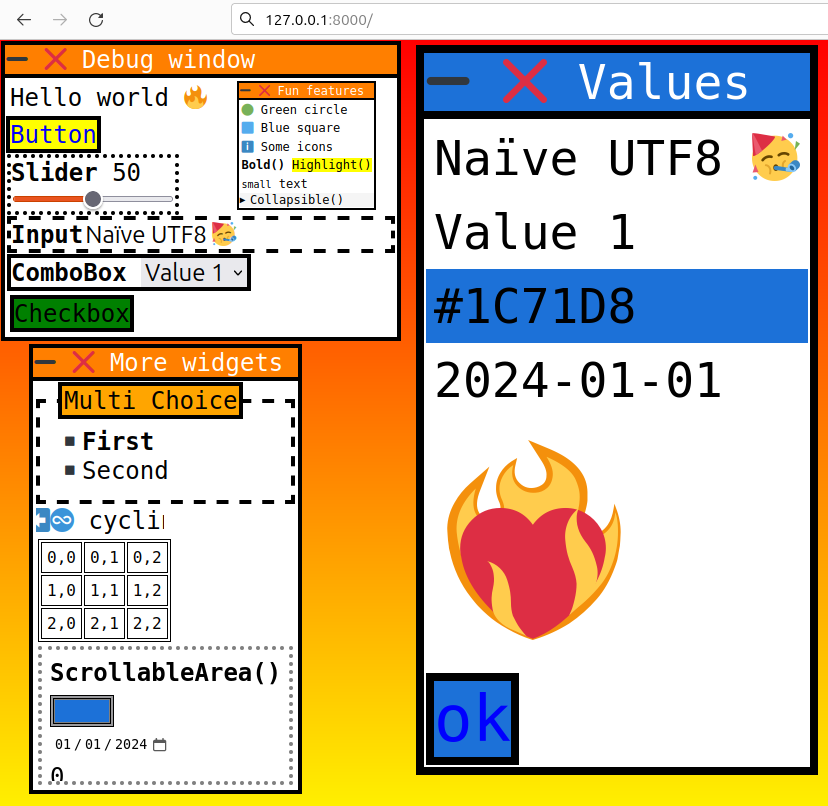

# ```mojo-ui-html```


- ### 👷👷‍♀️ Under construction, make sure to wear a helmet !

- ### 🤕 Bugs and unexpected behaviours are to be expected

- ### ⏳ not beginner-friendly yet (will be in the future❤️‍🔥) 

- ### Not ready for use yet, feedbacks, ideas and contributions welcome!


&nbsp;

## ⚠️ 
- Server on ```127.0.0.1:8000```

- Dom generated from the content of values
  
  - ```example: "<input value='" + value + "'/>"```
  - ```UNSAFE because value content can generate/modify html or javascript.```

- If the widget id is the address of a value, two input widgets of the same value will trigger twice (need more thinking for solution)

- ```TextInput()``` do not support empty spaces yet, it is because the url will add ```%20``` to it!

- Blocking loop by default (can be manually re-configured if needed)
- Exit loop if request from other than "127.0.0.1" by default 
  - Just an additional safeguard, not been tested! 
  - Can be re-configured if needed (Bool)


- Probably more

&nbsp;




&nbsp;
### Code:
```python
def main():
    val = 50
    txt = String("Some value")
    boolval = True
    multichoicevalue = String("First")
    colorvalue = String("#FF0000")
    datevalue = String("2024-01-01") #⚠️ format might depend on country?
    GUI = Server() 
    
    POS = Position(1,1)
    POS2 = Position(1,350)
    POS3 = Position(32,512)
    POS4 = Position(512,16)

    combovalues = DynamicVector[String]()
    for i in range(5): combovalues.push_back("Value "+str(i))
    selection = 1

    while GUI.Event():
        with GUI.Window("Debug window",POS):
            GUI.Text("Hello world 🔥")
            if GUI.Button("Button"): val = 50 
            if GUI.Slider("Slider",val): 
                print("Changed")
            GUI.TextInput("Edit",txt) #spaces not supported yet 
            GUI.ComboBox("ComboBox",combovalues,selection)
            GUI.Text("value:"+txt)
            GUI.Toggle(boolval,"Checkbox")
        
        with GUI.Window("Test",POS2): 
            GUI.Text(txt)
            if selection < len(combovalues): #manual bound check for now
                GUI.Text("Selected:" + combovalues[selection])
        
        with GUI.Window("Fun features",POS3):
            GUI.Text(GUI.Circle.Green + " Green circle")
            GUI.Text(GUI.Square.Blue + " Blue square")
            GUI.Text(GUI.Accessibility.Info + " Some icons")
            GUI.Text(GUI.Bold("Bold() ")+GUI.Highlight("Highlight()"))
            GUI.Text(GUI.Small("small") + " text")

            with GUI.Collapsible("Collapsible()"):
                GUI.Text("Content")

        with GUI.Window("More widgets",POS4):
            GUI.TextChoice("Multi Choice",multichoicevalue,"First","Second")
            GUI.Ticker("⬅️♾️ cycling left in a 128 pixels area",width=128)

            with GUI.Table():
                for r in range(3):
                    with GUI.Row():
                        for c in range(3): 
                            with GUI.Cell():
                                GUI.Text(str(r) + "," + str(c))
    
            with GUI.ScrollableArea(123):
                GUI.Text(GUI.Bold("ScrollableArea()"))
                GUI.ColorSelector(colorvalue)
                GUI.NewLine()
                GUI.DateSelector(datevalue) #⚠️ format is unclear
                # require way more thinking !
                for i in range(10): GUI.Text(str(i))
```

&nbsp;

## Features
- Themed with CSS inside a struct, where widgets have a corresponding alias!
  - Default theme colors are kept familiar (🎁)🔥.
- Button
  - return True when clicked
- TextInput
  - mutate the argument (passed as inout) automatically
- Text
- Slider
  - return True on interaction
  - mutate the argument (passed as inout) automatically
  - supports click but not drag yet (the moving window event is triggered)
  - min=0, max=100 keyword arguments
- Windowing system
  - Moved by dragging! 🥳
  - Can be defined in a nested way: moving "main" will keep "nested" in relative position.
  - Positions saved on the mojo side in user defined values (Position(0,0))
- Toggle widget (similar to checkbox)
   - Mutate a bool passed as argument (inout)
- ComboBox
   - ID is the inout address of the selection value
   - The selection value is the index of the selected value in the DynamicVector of selections
  - VariadicList support ! 🔥
    - ```ComboBox("Simple combobox",selection,"one","two","three")```


- Collapsible
  - Implemented as a with block

- TextChoice
  - Inout string to store the selected value 
  - Available choices as a variadic list
  - ```TextChoice("Label", selected, "First", "Second")```

- Ticker 
  - Cycle left (⬅️♾️) in an area of a specifig width (200 pixels by default).
  - ```Ticker("Emojis are supported",width=64)```

- Table 
  - Simple but it is a start! 
  - Example:
    ```python
    with GUI.Table():
      for r in range(3):
          with GUI.Row():
              for c in range(3): 
                  with GUI.Cell():
                      GUI.Text(str(r) + "," + str(c))   
    ```

- ScrollableArea 🔥
  - ```height:Int = 128``` (pixels)
  - Example:
    ```python
    with GUI.ScrollableArea(50):
      for i in range(10): GUI.Text(str(i))
    ```

- NewLine()

- 🎨 ColorSelector
  - One inout string argument (example: ```"#FF0000"```)

- 🗓️ DateSelector
  - ⚠️ not sure at all about the date format:
    - Not same for every machine?
    - Todo: unix timestamp
  - One inout string argument (example: ```"2024-01-01"```)
  

- Add html manually:
   - GUI.response += "\ **Hello**
  - Highlight("Hello")
  - Small("Hello")
  - Digitize(153) -> 1️⃣5️⃣3️⃣
  - Square.Green 🟩 and Circle.Yellow 🟡 (Blue, Red, Black, Purple, Brown, Orange, Green, Yellow, White)
  - Accessibility.Info (Info ℹ️, Warning ⚠️, Success ✅)
  - Arrow.Right (Up ⬆️, Down ⬇️, Right ➡️, Left ⬅️)

&nbsp;

## Mechanism
The address of a value passed as an ```inout argument``` is used as a dom element id to check for events.

For example, ```GUI.Slider("Slider",val)``` will generate an html input element with the id ```address of val```.

The generated html is sent, and the page listen for any event on ```<body>```.

If an event occur on the page, it first check if the target element is marked with data-attribute (example: data-change).

If it is the case, an url is generated, according to:
-  the e.target dom element id
- the target value (depending on wich widget it represent)

In this example: ```/slider_address_of_val/new_dom_element_value```.

The page is then redirected to that url in order to "send" the event.

On the mojo side, an event is "received" and
the loop runs again. 

This time, the inout argument address will correspond to the current event url and the new value is assigned.

Anything can be used to generate an id, require more thinking ! 


&nbsp;

## Characteristics:
### 🏜️ Less dependencies
- Use a socket as PythonObject for now
- To make it platform agnostic and ready to runs anywhere with little changes.

### 🛞 Non blocking event loop (default mode: blocking)
- Usecase: if no request/event, custom user defined calculations on multiple workers.
- Additionally, slowed down by a call to the time.sleep()

### 🏕️ Immediate mode vs retained
- Works inside an explicitely user-defined loop
  - the user choose what should happen when there are no events. (not implemented yet)
- The full dom is re-generated after each event 
### 🎨 CSS and HTML
- Interesting features:
  - audio/video playing
  - drag and drop
  - modals
  - more
- To implement custom widgets
  - Both are user friendly and easy to learn


&nbsp;

## For the future:
- Toast messages (```notifications```)
- ```Ticker widget```: a banner where text move in a loop at a specified speed
- A ```node system``` (plug, drag-drop)
- Widget to form a number using the scrollwheel (modify individual hovered digits)
- ```XHR Post``` instead of ```get /widget_id/newvalue  ```
  - should fix ```%20``` problem
  - play ```audio``` in an independent DOM element
- ```Drag and drop``` capabilities (example: list to list)
- Move the generated css from attributes to \<Style\> or /styles.css (smaller page and/or cached)
- ✏️

&nbsp;

## Current implementation challenges:
- Can't do nested type to create a tree of dom elements without pointers, better to wait a little for that.
  - ( ```struct Element(CollectionElement): var elements: DynamicVector[Self]``` )
  - the dom could be transfered as json and re-generated safer-ly in a loop.

- ```onchange``` is used instead of ```oninput``` (to not keep track of dom element focus, temporarely)
  - solved by generating serialized dom as nested nodes, and "morphing" it
- More

&nbsp;


